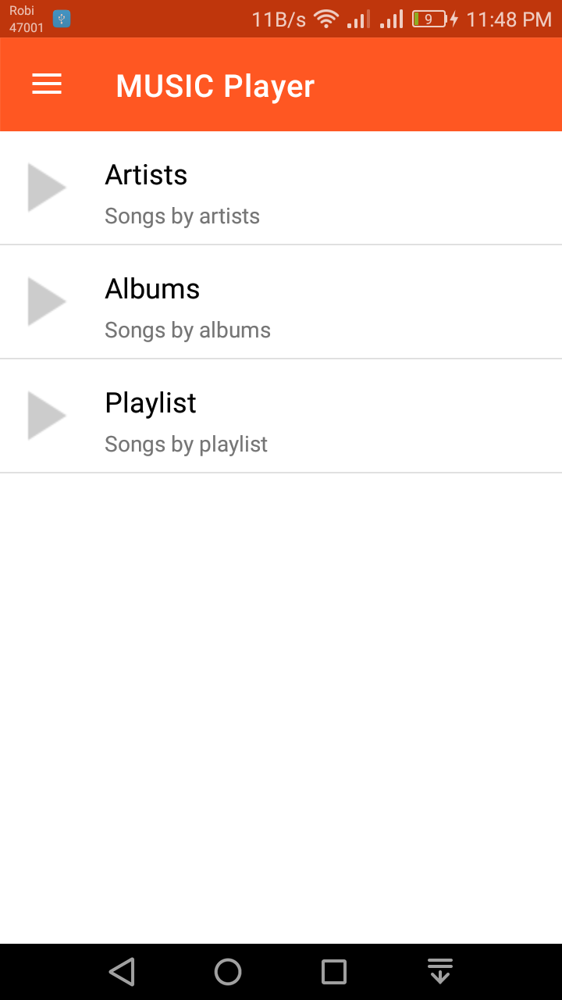
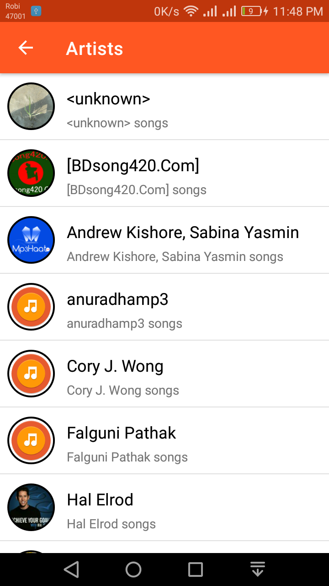
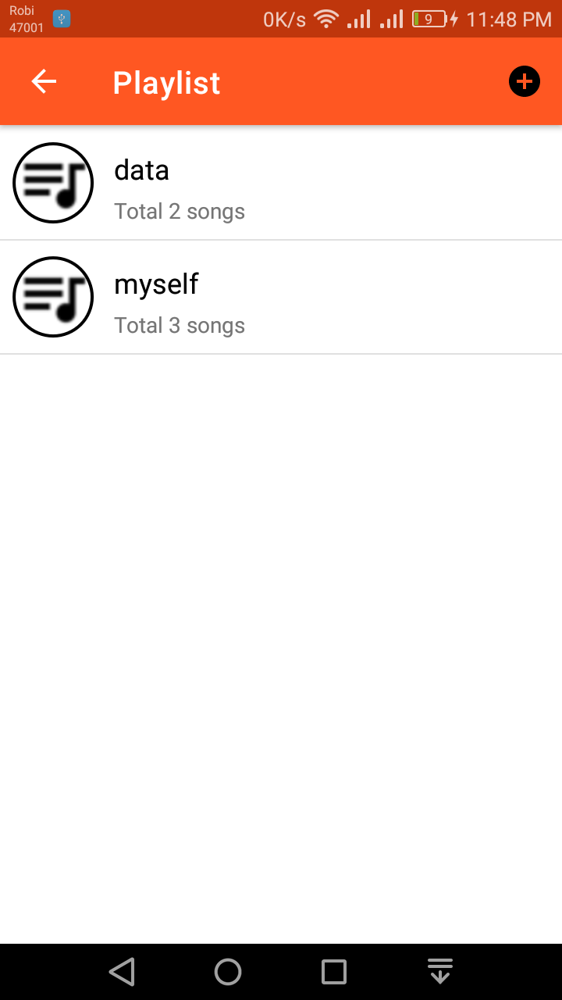
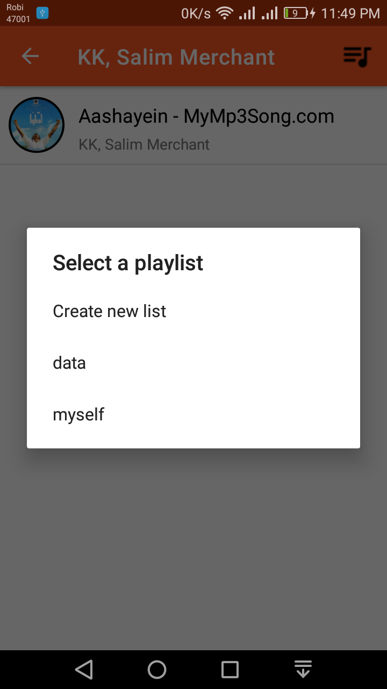

# Music Player

A complete music player with playlist options. In this project the UI of old universal music player is used, but the layout created with new component of android like constrain layout, card view. For this project, exoplayer is for music play. This app support latest android 10.


### Features

1. Play Music option
2. Browse Songs by Albums
3. Browse songs by artist
4. Play list
   1. Add and remove songs to playlist
   2. Create and delete playlist
5. App widget to play the playlist


### Screenshots

||||
| ---- | ---- | ---- |
||||
||||


## Architecture

Language: **Kotlin**

Design pattern: **MVVM**

DI: **KOIN**

Libraries

1. Android Extension Helper
2. Coroutines
3. Exoplayer
4. Glide
5. Timber
6. Toasty
7. Gson


## Want to test

Android Studio: 3.5.3

Compile SDK: 29

Target SDK: 29

```
git clone https://github.com/Iamsdt/MusicPlayer.git
```


## License

This project is under [Apache License 2.0]( https://github.com/Iamsdt/MusicPlayer/blob/master/LICENSE ). 

```
Copyright {2020} {Shudipto Trafder}

Licensed under the Apache License, Version 2.0 (the "License");
you may not use this file except in compliance with the License.
You may obtain a copy of the License at

       http://www.apache.org/licenses/LICENSE-2.0

Unless required by applicable law or agreed to in writing, software
distributed under the License is distributed on an "AS IS" BASIS,
WITHOUT WARRANTIES OR CONDITIONS OF ANY KIND, either express or implied.
See the License for the specific language governing permissions and
limitations under the License.
```


